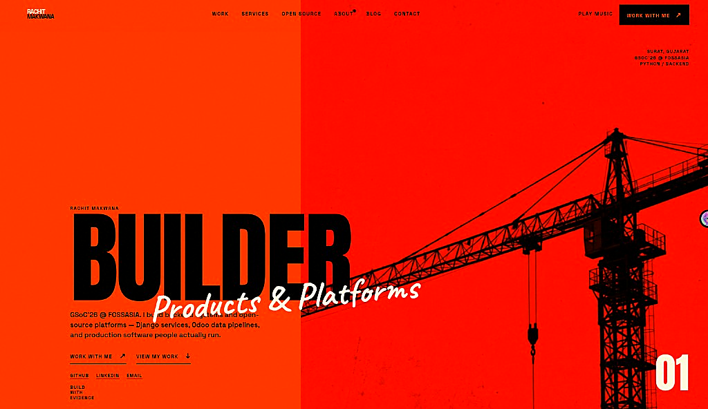

  

  <a href="https://rachit7168.github.io/Rachit-Makwana/"><strong>Portfolio →</strong></a>
  ·
  <a href="https://rachit7168.github.io/Rachit-Makwana/blog/how-i-got-into-gsoc.html">How I Got Into GSoC</a>
  ·
  <a href="https://github.com/Rachit7168">GitHub</a>
  ·
  <a href="https://www.linkedin.com/in/rachit-makwana-py-dev">LinkedIn</a>

  <b>GSoC’26 @ FOSSASIA</b> · Python / Backend · Surat, India

