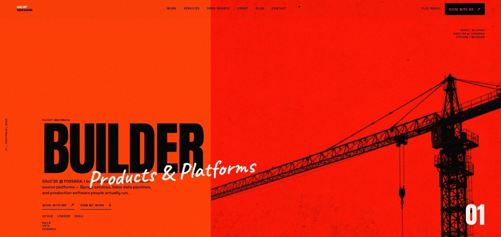

  

  <a href="https://rachit7168.github.io/Rachit-Makwana/"><strong>View portfolio →</strong></a>
  ·
  <a href="https://rachit7168.github.io/Rachit-Makwana/work.html">Work</a>
  ·
  <a href="https://rachit7168.github.io/Rachit-Makwana/contact.html">Contact</a>
  ·
  <a href="https://www.linkedin.com/in/rachit-makwana-py-dev">LinkedIn</a>

### About
GSoC’26 @ FOSSASIA · Python / backend developer in Surat.  
Building open-source platforms (Eventyay), data pipelines, and production software.

